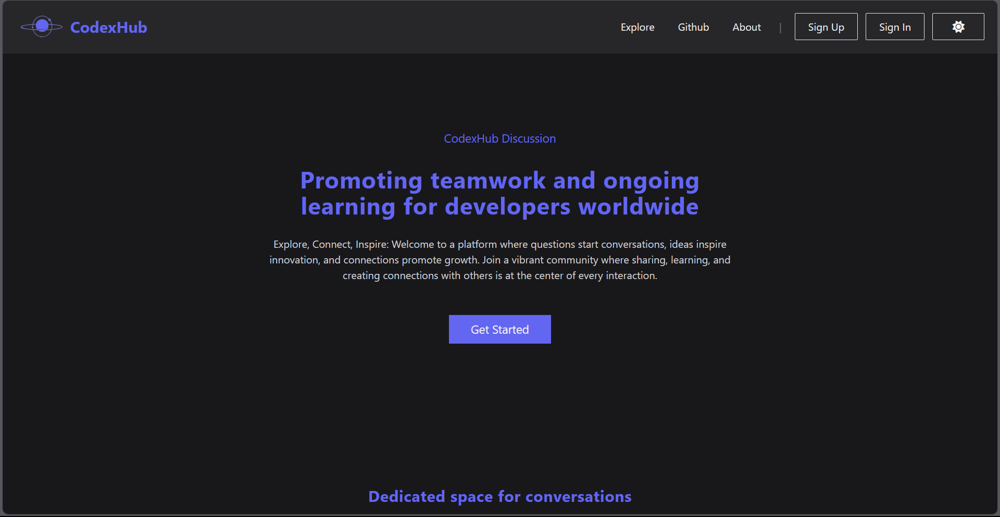

<h1 align="center">
     📰 <a href="" alt="React URL">CodexHub</a>
</h1>

<p align="center">
  

  
  
  
  
  
   
   <a href="https://github.com/ovasconceloss/dev-news/stargazers">
    
  </a> 
</p>

<hr>



<hr>

## 💻 About

CodexHub is a minimalist website designed to act as a straightforward forum where users can easily access a variety of programming-related content. With just a few clicks, visitors can explore a range of resources that truly enhance their knowledge.

---

## ⚙️ Features

- [x] Create account
- [ ] Search posts by topic
- [x] Turn on a user profile
- [ ] Create posts (questions)
- [ ] Comment on posts (questions)

---

## 🚀 Get Started

### Prerequisites

Before you begin, you will need to have the following tools installed on your machine: [Git](https://git-scm.com) and [Node.js](https://nodejs.org/en/). 

#### 🧭 Running Application - FrontEnd

```bash

# Clone this repository
$ git clone https://github.com/OVasconceloss/codex-hub.git

# Access the project folder in your terminal/cmd
$ cd client

# Install the dependencies
$ npm install

# Run the application in development mode
$ npm run dev

# The application will be opened on port:5173 - go to http://localhost:5173

```

#### 🧭 Running Application - BackEnd

```bash

# Clone this repository
$ git clone https://github.com/OVasconceloss/codex-hub.git

# Access the project folder in your terminal/cmd
$ cd server

# Install the dependencies
$ npm install

# Run the application in development mode
$ npm run dev

# The application will be opened on port:8080 - go to http://localhost:8080

```

---

## 🛠 Technologies

#### **Website**  ([React](https://reactjs.org/) + [Typescript](https://www.typescriptlang.org/)  +  [Tailwind CSS](https://tailwindcss.com/docs/installation))

-   **[Axios](https://github.com/axios/axios)**
-   **[Prisma](https://www.prisma.io/)**
-   **[Dotenv](https://www.npmjs.com/package/dotenv)**
-   **[MongoDB](https://www.mongodb.com/)**
-   **[FontAwesome](https://fontawesome.com/v5/docs/web/use-with/react)**
-   **[React Router Dom](https://github.com/ReactTraining/react-router/tree/master/packages/react-router-dom)**

> See the file [package.json](./package.json)

#### [](https://github.com/tgmarinho/Ecoleta#utilit%C3%A1rios)**Utilities**

-   Icons: **[Font Awesome](https://fontawesome.com/)**
-   Editor:  **[Visual Studio Code](https://code.visualstudio.com/)**
-   Commit Conventional:  **[Conventional Commits](https://www.conventionalcommits.org/en/v1.0.0/)**


---
## 💪 How to Contribute

1. Make a **fork** of the project.
2. Create a new branch with your changes: `git checkout -b my-feature`
3. Save the changes and create a commit message: `git commit -m "feature: My new feature"`
4. Send your changes: `git push origin my-feature`

---

## 📝 License

This project is under license [MIT](./LICENSE).

---
